# 🔤 Transformer from Scratch - English to Hindi Translation


This project implements the **original Transformer architecture** from scratch using **PyTorch**, with an application to **English-to-Hindi translation**. The goal is not to achieve state-of-the-art translation accuracy, but rather to deeply understand and manually build each component of the Transformer model as introduced in *"Attention is All You Need"* (Vaswani et al., 2017).

> 🎯 **Educational Focus**: Every component is built from first principles with detailed comments and explanations  
> 🚫 **No Black Boxes**: Zero dependencies on HuggingFace Transformers or `nn.Transformer`  
> 🔍 **Full Transparency**: Complete visibility into attention mechanisms and training dynamics

---

## 🏗️ Architecture Overview

The implementation follows the original Transformer paper exactly:

```mermaid
graph TB
    subgraph "Input Processing"
        A[English Input: 'How are you?'] --> B[Input Embedding]
        B --> C[+ Positional Encoding]
        D[Hindi Input: 'कैसे हैं'] --> E[Output Embedding]
        E --> F[+ Positional Encoding]
    end
    
    subgraph "Encoder Stack (6 layers)"
        C --> G[Multi-Head Self-Attention]
        G --> H[Add & Norm]
        H --> I[Feed Forward]
        I --> J[Add & Norm]
        J --> K[Encoder Output]
    end
    
    subgraph "Decoder Stack (6 layers)"
        F --> L[Masked Multi-Head Self-Attention]
        L --> M[Add & Norm]
        M --> N[Multi-Head Cross-Attention]
        K --> N
        N --> O[Add & Norm]
        O --> P[Feed Forward]
        P --> Q[Add & Norm]
    end
    
    subgraph "Output Generation"
        Q --> R[Linear Projection]
        R --> S[Softmax]
        S --> T[Hindi Output: 'कैसे हैं आप?']
    end
    
    %% Dark theme styling
    style A fill:#1e3a8a,stroke:#3b82f6,color:#ffffff
    style T fill:#166534,stroke:#22c55e,color:#ffffff
    style K fill:#854d0e,stroke:#f59e0b,color:#ffffff
    style G fill:#581c87,stroke:#a855f7,color:#ffffff
    style N fill:#991b1b,stroke:#ef4444,color:#ffffff

```



### Core Components Implemented

- **Multi-Head Self-Attention**: Scaled dot-product attention with multiple heads
- **Positional Encoding**: Sinusoidal position embeddings for sequence awareness
- **Encoder Stack**: 6 identical layers with self-attention and feed-forward networks
- **Decoder Stack**: 6 identical layers with masked self-attention and encoder-decoder attention
- **Feed-Forward Networks**: Position-wise fully connected layers with ReLU activation
- **Layer Normalization**: Applied before each sub-layer (pre-norm architecture)
- **Residual Connections**: Skip connections around each sub-layer

---

## 🚀 Features

### ✅ Complete Transformer Implementation
- **Multi-Head Self-Attention**: Parallel attention computation across multiple representation subspaces
- **Positional Encoding**: Sinusoidal embeddings to inject sequence position information
- **Encoder & Decoder Blocks**: Full transformer architecture with proper masking
- **Masked Self-Attention**: Prevents decoder from seeing future tokens during training
- **Cross-Attention**: Allows decoder to attend to encoder outputs
- **Greedy Decoding**: Simple inference strategy for sequence generation

### ✅ Training Infrastructure
- **Custom Training Loop**: Complete training pipeline with gradient accumulation
- **Loss Computation**: Cross-entropy loss with padding token masking
- **Optimizer**: Adam optimizer with learning rate scheduling
- **Evaluation Metrics**: BLEU score calculation for translation quality

### ✅ Educational Features
- **Detailed Comments**: Every function and class thoroughly documented
- **Visualization Tools**: Attention weight visualization capabilities
- **Modular Design**: Each component can be studied and modified independently
- **Debug Mode**: Optional verbose logging for understanding model behavior

---

## 🧪 Quick Demo

```python
# Example translation
input_text = "How are you?"
translated = model.translate(input_text)
print(f"Input: {input_text}")
print(f"Output: {translated}")  # कैसे हैं आप?
```

### More Examples

| English Input | Hindi Output | Quality |
|---------------|-------------|---------|
| "Hello world" | "हैलो वर्ल्ड" | ✅ Good |
| "How are you?" | "कैसे हैं आप?" | ✅ Good |
| "I love programming" | "मुझे प्रोग्रामिंग पसंद है" | ⚠️ Decent |
| "The weather is nice today" | "आज मौसम अच्छा है" | ⚠️ Decent |

---

## 📊 Training Results

### Performance Metrics

| Epoch | Train Loss | Validation Loss | BLEU Score | Learning Rate |
|-------|------------|-----------------|------------|---------------|
| 1     | 6.45       | 6.12            | 0.004      | 1e-4          |
| 10    | 3.89       | 4.23            | 0.059      | 8e-5          |
| 25    | 2.15       | 3.01            | 0.098      | 6e-5          |
| 50    | 0.90       | 2.34            | 0.135      | 4e-5          |

### Training Configuration

```python
# Model hyperparameters (following original paper)
d_model = 512          # Model dimension
n_heads = 8            # Number of attention heads
n_layers = 6           # Number of encoder/decoder layers
d_ff = 2048           # Feed-forward dimension
dropout = 0.1          # Dropout rate
max_seq_len = 100     # Maximum sequence length
```

### Training Process Flow


> 📝 **Note**: BLEU scores are intentionally low as this is a learning implementation trained on a small dataset with minimal preprocessing. The focus is on understanding the architecture, not achieving production-level performance.

---

## 🛠️ Installation & Setup

### Prerequisites

- Python 3.8+
- PyTorch 1.9+
- Basic understanding of neural networks and attention mechanisms

### Installation

```bash
# Clone the repository
git clone https://github.com/yourusername/transformer-from-scratch.git
cd transformer-from-scratch

# Install dependencies
pip install -r requirements.txt

# The dataset is already included in the data/ folder
# Tokenizers are pre-trained and saved as JSON files
```

### Requirements

```txt
torch>=1.9.0
numpy>=1.21.0
matplotlib>=3.5.0
nltk>=3.6
sacrebleu>=2.0.0
tqdm>=4.62.0
```

---

## 🏃‍♂️ Usage

### Getting Started

The entire implementation is contained in a single Jupyter notebook for easy learning and experimentation:

```bash
# Start Jupyter notebook
jupyter notebook

# Open the main implementation
# notebooks/Transformer_from_scratch.ipynb
```

### Training the Model

Run the cells in the notebook sequentially:

1. **Data Loading**: Load English-Hindi parallel corpus
2. **Tokenization**: Use pre-trained tokenizers for both languages
3. **Model Definition**: Build Transformer from scratch
4. **Training Loop**: Train with custom loss and optimization
5. **Evaluation**: Test on sample translations and compute BLEU scores

### Quick Translation Test

```python
# Inside the notebook, after training:
test_sentences = [
    "How are you?",
    "Hello world",
    "I love programming"
]

for sentence in test_sentences:
    translation = translate(sentence)
    print(f"English: {sentence}")
    print(f"Hindi: {translation}")
    print("-" * 40)
```

---

## 📁 Project Structure

```
transformer-from-scratch/
├── data/
│   ├── .about.txt              # Dataset information and sources
│   ├── english.txt             # English sentences (source)
│   ├── hin.txt                 # Hindi sentences (target)
│   └── hindi.txt               # Hindi sentences (alternative)
├── notebooks/
│   ├── Transformer_from_scratch.ipynb  # Main implementation notebook
│   ├── eng_tokenizer.json      # English tokenizer vocabulary
│   └── hin_tokenizer.json      # Hindi tokenizer vocabulary
└── README.md                   # Project documentation
```

### Key Files Explained

- **`data/`**: Contains parallel English-Hindi corpus
  - `english.txt` & `hin.txt`: Aligned sentence pairs for training
  - `.about.txt`: Dataset source and preprocessing information
  
- **`notebooks/`**: Jupyter notebook with complete implementation
  - `Transformer_from_scratch.ipynb`: Full model implementation and training
  - `eng_tokenizer.json` & `hin_tokenizer.json`: Pre-trained tokenizers for both languages

---

## 🧠 Key Learning Outcomes

### Understanding Attention Mechanisms
- **Self-Attention**: How tokens relate to each other within a sequence
- **Multi-Head Attention**: Parallel attention computation for different representation subspaces
- **Attention Masking**: Preventing information leakage during training
- **Scaled Dot-Product**: Mathematical foundation of attention computation

### Transformer Architecture Insights
- **Position Encoding**: Why and how positional information is injected
- **Encoder-Decoder Attention**: How decoder accesses encoder representations
- **Layer Normalization**: Impact on training stability and convergence
- **Residual Connections**: Gradient flow and training dynamics

### Practical Implementation Challenges
- **Memory Management**: Handling attention computation for long sequences
- **Numerical Stability**: Preventing overflow in attention softmax
- **Gradient Flow**: Ensuring proper backpropagation through deep networks
- **Tokenization**: Handling out-of-vocabulary words and special tokens

---

## 📈 Performance Analysis

### Attention Pattern Visualization

The model learns meaningful attention patterns:

- **Early Layers**: Focus on local dependencies and syntactic relationships
- **Middle Layers**: Capture semantic relationships and phrase-level patterns  
- **Late Layers**: Integrate global context for translation decisions

### Training Dynamics

```python
# Training loss curve shows expected behavior:
# - Rapid initial decrease
# - Gradual improvement with occasional plateaus
# - Final convergence around epoch 40-50
```

---

## 🔧 Customization & Experiments

### Modify Model Architecture

```python
# Experiment with different configurations
config = {
    'd_model': 256,        # Smaller model for faster training
    'n_heads': 4,          # Fewer attention heads
    'n_layers': 4,         # Shallower network
    'd_ff': 1024,          # Smaller feed-forward
    'dropout': 0.2         # Higher dropout for regularization
}
```

### Try Different Datasets

The code is designed to work with any parallel corpus:

```python
# Adapt for different language pairs
python train.py --src_lang en --tgt_lang fr --data_path data/en_fr.txt
```

---

## 📚 Educational Resources

### Essential Papers
- **Original Transformer**: [Attention Is All You Need](https://arxiv.org/abs/1706.03762) (Vaswani et al., 2017)
- **BLEU Metric**: [BLEU: a Method for Automatic Evaluation of Machine Translation](https://aclanthology.org/P02-1040/) (Papineni et al., 2002)
- **Layer Normalization**: [Layer Normalization](https://arxiv.org/abs/1607.06450) (Ba et al., 2016)

### Recommended Reading
- [The Illustrated Transformer](https://jalammar.github.io/illustrated-transformer/) by Jay Alammar
- [The Annotated Transformer](https://nlp.seas.harvard.edu/2018/04/03/attention.html) by Harvard NLP
- [Attention and Augmented Recurrent Neural Networks](https://distill.pub/2016/augmented-rnns/) by Distill

### Video Tutorials
- [Attention is All You Need](https://www.youtube.com/watch?v=iDulhoQ2pro) by Yannic Kilcher
- [Transformer Neural Networks Explained](https://www.youtube.com/watch?v=TQQlqn0dF_4) by CodeEmporium

---

## 🐛 Known Issues & Limitations

### Current Limitations
- **Small Dataset**: Trained on limited parallel corpus for demonstration
- **Simple Tokenization**: Basic word-level tokenization without subword handling
- **Greedy Decoding**: No beam search or other advanced decoding strategies
- **No Optimization**: Focus on clarity over computational efficiency

### Future Improvements
- Implement subword tokenization (BPE/SentencePiece)
- Add beam search and nucleus sampling
- Optimize memory usage for longer sequences
- Add support for different language pairs

---

## 📄 License

This project is licensed under the MIT License - see the [LICENSE](LICENSE) file for details.

---

## 👨‍💻 Author

**Rudransh Kumar Ankodia**  
🔗 [GitHub](https://github.com/rudranx) | 📧 [Email](mailto:rudransh1896@gmail.com)

*Built with ❤️ for anyone curious about how Transformers really work under the hood.*

---

## 🙏 Acknowledgments

- Original Transformer paper authors for the groundbreaking architecture
- PyTorch team for the excellent deep learning framework
- The open-source community for parallel corpus datasets
- Everyone who has contributed to making NLP accessible through educational resources

---
